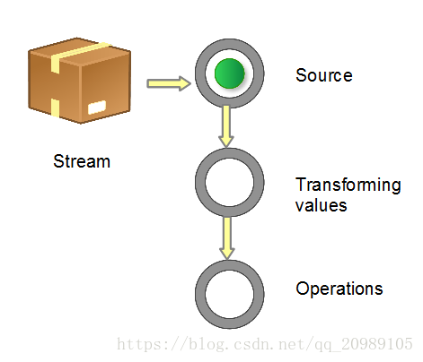
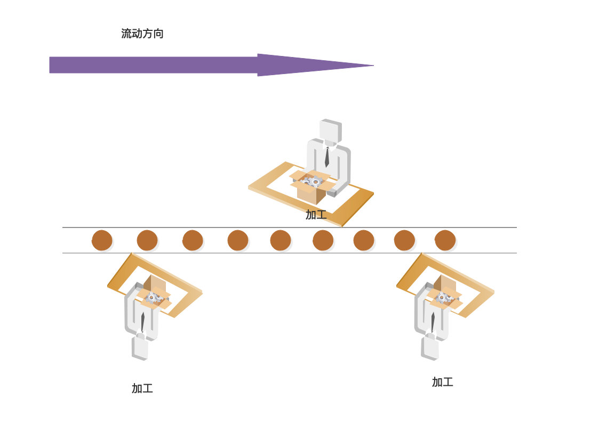

[TOC]

# lambda & Stream

# Lambda

## 什么是Lambda

 Lambda 允许把函数作为一个方法的参数（函数作为参数传递进方法中） 

## 为什么引入Lambda

先来看一个例子，比如创建一个线程（输出"thread run ..."）并执行

```
// 运行MyRunnable线程
public class T(){
    public static void main(String[] args){
        // 方式1. 需要创建一个Runnable接口的实现类 MyRunnable
        Runnable r = new MyRunnable();
        Thread t = new Thread(r);
        t.start();
        
        // 方式2. 或写成匿名类
        Runable r = new MyRunnable(){
            public void run(){
                System.out.println("Thread run ...");
            }
        }
        Thread t = new Thread(r);
        t.start();
        
    }
}

// 为了执行一个线程，我们要定义一个实现Runnable的run接口的类
public class MyRunnable implements Runnable{
	public void run(){
		System.out.println(" thread run ...");
	}
}
```

从例子中可以看出仅仅是只为了输出一个"thread run..."，则我们要写的代码大部分都是为了输出这一句话而写的实现接口类的代码（MyRunnable类或匿名类）

如果使用Lambda表达式，将输出"thread run ..."的功能直接写成一个函数传到Thread类构造器中，则代码将大大简化，例如

```
public class T(){
    public static void main(String[] args){
        Thread thread = new Thread(() -> {System.out.println("thread run...");});
        thread.start();
    }
}
```

可以看到，不用再编写Runnable接口的实现类了，而是用一个类似于箭头函数`()->{}`的代码表示一个Runnable.run接口的实现就可以了。大大减少了代码量。箭头函数就是接口的实现。

Lambda是为简化代码而生，简化了接口实现的代码。

更多的Lambda表达式

```
(int a, int b) -> {  return a + b; }
() -> System.out.println("Hello World");
(String s) -> { System.out.println(s); }
() -> 42
() -> { return 3.1415 };
```

 语法分为3段式：参数 、`->` 以及语句，即`（...）-> { ...}` 

## Lambda优缺点

**优点：**

1. 少量的代码就能替代以前的一大堆循环判断过滤等，代码简洁。

**缺点：** 

1. 用Lambda充当匿名内部类、方法引用等场合效率低。
2. Lambda的特点还在于开发成本高，并且异常难以排查。它的异常堆栈比匿名内部类还要难懂。如果你把stream的操作都写在同一行，则问题更甚。
3. 代码维护性差。

## Lambda表达式语法

- 左边括号：lambda的形参列表，就好比是我们定义一个接口，里面有一个抽象方法，这个抽象方法的形参列表。（当只有且只有一个参数时可省略括号）
- 箭头：lambda的操作符，所以你看见这个箭头心中知道这是一个lambda表达式就可以了。
- 右边大括号：lambda方法体，就好比是我们实现了接口中的抽象方法。(当方法体只有一条语句的时候可以省略大括号)

例如
```
(int a, int b) -> {  return a + b; }
() -> System.out.println("Hello World");
(String s) -> { System.out.println(s); }
() -> 42
() -> { return 3.1415 };
```
- 一个 Lambda 表达式可以有零个或多个参数
- 参数的类型既可以明确声明，也可以根据上下文来推断。例如：`(int a)`与`(a)`效果相同
- 所有参数需包含在圆括号内，参数之间用逗号相隔。例如：`(a, b)` 或 `(int a, int b)` 或 `(String a, int b, float c)`
- 空圆括号代表参数集为空。例如：`() -> 42`
- 当只有一个参数，且其类型可推导时，圆括号（）可省略。例如：`a -> return a*a`
- Lambda 表达式的主体可包含零条或多条语句
- 如果 Lambda 表达式的主体只有一条语句，花括号{}可省略。匿名函数的返回类型与该主体表达式一致
- 如果 Lambda 表达式的主体包含一条以上语句，则表达式必须包含在花括号{}中（形成代码块）。匿名函数的返回类型与代码块的返回类型一致，若没有返回则为空

## Lambda使用条件

当接口只有一个抽象方法的时候才可以使用，这样的接口称作函数接口（也就是用@FunctionalInterface修饰的接口）。下面介绍一下函数接口

## 函数接口

Java是强类型语言，方法参数都有固定的类型。那么问题了，Lambda表达式，如果当做是一堆代码片段，也会表达一种明确的意图，这个意图，姑且可以理解为函数接口。

在编程过程中，总会遇到很多函数接口，以下是JDK中一些比较最重要的函数接口

接口参数返回类型示例

| 接口              | 参数   | 返回类型 | 示例               |
| ----------------- | ------ | -------- | ------------------ |
| Predicate<T>      | T      | boolean  | 值等于“Hello”吗？  |
| Consumer<T>       | T      | void     | 输出一个值         |
| Function<T,R>     | T      | R        | 获取对象的一个属性 |
| Supplier<T>       | None   | T        | 工厂方法           |
| UnaryOperator<T>  | T      | T        | 逻辑非（！）       |
| BinaryOperator<T> | (T, T) | T        | 求2个数的和（+）   |

进入到上面接口的源码可以看到，所有的接口都是使用@FunctionalInterface修饰的。

```
@FunctionalInterface
public interface Consumer<T> {
    /**
     * Performs this operation on the given argument.
     *
     * @param t the input argument
     */
    void accept(T t);
}
```
`@FunctionalInterface` 是 Java 8 新加入的一种接口，用于指明该接口类型声明是根据 Java 语言规范定义的函数式接口（接口中只有一个抽象方法）。

例如自己定义一个函数接口

```
package com.thd.basic.lambda.test01;
// @FunctionalInterface 注释代表该接口只有一个抽象公共方法
@FunctionalInterface
public interface MyInterface {
    public String hello(String name);
}
```

则可以用下面几种lambda表达式来进行变量声明

```
MyInterface exam01 = name -> "Hello" + name;
MyInterface exam02 = (name) -> "Hello" + name;
MyInterface exam03= (String name) -> "Hello" + name;
```

上面的lambda表达式就是MyInterface.hello接口的实现，其中**Lambda表达式的参数个数、类型和返回值类型要与接口保持一致**！

## 方法引用

有时候，lambda体可能仅仅调用一个已存在的方法（换句话说已有类的方法完全能够替代方法体中的内容，也就是已存在的某个方法的参数和返回值与所需接口完全匹配），而不做任何其它事，对于这种情况，通过一个方法名字来引用这个已存在的方法会更加清晰。 

方法引用的操作符是双冒号 "::"

```
Arrays.asList(pArr).forEach( p -> {System.out.println(p);});
Arrays.asList(pArr).forEach( System.out::println);
```

### 方法引用的前提

1. 已有类的方法能够满足Lambda方法体中的内容（Lambda方法体只要一个现有方法就能实现，没有其他逻辑）
2. 现有方法的参数个数、类型与返回值类型与Lambda所替代的接口的方法一致

### 方法引用分类

1.类名::静态方法名
2.对象::实例方法名
3.类名::实例方法名
4.类名::new 


## 常用的内置Lambda接口

有了Lambda后，对于一些接口的实现我们就可以直接使用Lambda代替接口实现了，但是为了使用Lambda我们通常要创建一些接口，例如

```
public interface MyInterface01(){
	public void todo();
}
public interface MyInterface02<T>(){
	public T todo();
}
public interface MyInterface03<T>(){
	public void todo(T t);
}
public interface MyInterface03<T,R>(){
	public R todo(T t);
}
```

这样一来，我们使用Lambda仍需创建类似于这样的接口，其实就是为了描绘接口参数类型、个数以及返回值类型。还是不太方便。Java8中已经为我们创建好了标准的接口。

### 内置Lambda接口分类

Java8中已经为我们创建好了标准的接口，这些接口就是定义了常用的函数接口的参数类型、个数以及返回值类型

####  Consumer<T> : 消费型接口 

有一个参数，类型为T，无返回值

```
void accept(T t);
```

```
//Consumer<T> 消费型接口 :
@Test
public void test1(){
	happy(10000, (m) -> System.out.println("此次购物消费" + m + "元"));
} 

public void happy(double money, Consumer<Double> con){
	con.accept(money);
}
```


#### Supplier<T> : 供给型接口

没有参数，返回值类型为T

```
T get(); 
```

```
//Supplier<T> 供给型接口 :
@Test
public void test2(){
	List<Integer> numList = getNumList(10, () -> (int)(Math.random() * 100));
	for (Integer num : numList) {
		System.out.println(num);
	}
}
    
//需求：产生指定个数的整数，并放入集合中
public List<Integer> getNumList(int num, Supplier<Integer> sup){
    List<Integer> list = new ArrayList<>();
    for (int i = 0; i < num; i++) {
        Integer n = sup.get();
        list.add(n);
    }
    return list;
}
````

#### Function<T, R> : 函数型接口

有一个参数类型为T，返回值类型为R

```
R apply(T t);
```

```
//Function<T, R> 函数型接口：
@Test
public void test3(){
	String newStr = strHandler("\t\t\t 我大尚硅谷威武   ", (str) -> str.trim());
	System.out.println(newStr);

	String subStr = strHandler("我大尚硅谷威武", (str) -> str.substring(2, 5));
	System.out.println(subStr);
}

//需求：用于处理字符串
public String strHandler(String str, Function<String, String> fun){
	return fun.apply(str);
}
```
#### Predicate<T> : 断言型接口

有一个参数，类型为T，返回值是boolean

```
boolean test(T t);
```

```
//Predicate<T> 断言型接口：
@Test
public void test4(){
	List<String> list = Arrays.asList("java", "php", "android", "ios", ".net");
	List<String> strList = filterStr(list, (s) -> s.length() > 4);

    for (String str : strList) {
        System.out.println(str);
    }
}
    
//需求：将满足条件的字符串，放入集合中
public List<String> filterStr(List<String> list, Predicate<String> pre){
	List<String> strList = new ArrayList<>();
	for (String str : list) {
		if(pre.test(str)){
			strList.add(str);
		}
	}
	return strList;
}
```
## Lambda总结

- Lambda：为了减少类的实现代码，Lambda诞生
- 方法引用：如果Lambda体中的内容已有类方法可以替代，则引出了方法引用的概念
- 内置Lambda接口：方法引用仍需创建接口类则引出了Lambda常用内置接口

lambda和方法引用使用前提：接口的参数个数、类型以及返回值类型与Lambda表达式或引用的方法一致

# Stream

## 什么是Stream

Stream（流）是一个来自数据源的元素队列并支持聚合操作 

Stream 不是集合元素，它不是数据结构并不保存数据，它是有关算法和计算的，它更像一个高级版本的 Iterator。原始版本的Iterator，用户只能显式地一个一个遍历元素并对其执行某些操作；高级版本的 Stream，用户只要给出需要对其包含的元素执行什么操作，比如 “过滤掉长度大于 10 的字符串”、“获取每个字符串的首字母”等，Stream 会隐式地在内部进行遍历，做出相应的数据转换。

Stream 就如同一个迭代器（Iterator），`单向`，`不可往复`，`数据只能遍历一次`，`遍历过一次后即用尽了，就好比流水从面前流过`，一去不复返。 

而和迭代器又不同的是，Stream 可以并行化操作，迭代器只能命令式地、串行化操作。顾名思义，当使用串行方式去遍历时，每个 item 读完后再读下一个 item。而使用并行去遍历时，数据会被分成多个段，其中每一个都在不同的线程中处理，然后将结果一起输出。Stream 的并行操作依赖于 Java7 中引入的 Fork/Join 框架（JSR166y）来拆分任务和加速处理过程。


## parallelStream是什么

parallelStream其实就是一个并行执行的流.它通过默认的ForkJoinPool,可能提高你的多线程任务的速度.

parallelStream的作用：

Stream具有平行处理能力，处理的过程会分而治之，也就是将一个大任务切分成多个小任务，这表示每个任务都是一个操作，因此像以下的程式片段：


## 流的构成 

当我们使用一个流的时候，通常包括三个基本步骤：

获取一个数据源（source）→ 数据转换→执行操作获取想要的结果，每次转换原有 Stream 对象不改变，返回一个新的 Stream 对象（可以有多次转换），这就允许对其操作可以像链条一样排列，变成一个管道，如下图所示。



## 流的特点

1. 不是数据结构，不会保存数据。
2. 不会修改原来的数据源，它会将操作后的数据保存到另外一个对象中。（保留意见：毕竟peek方法可以修改流中元素）
3. 惰性求值，流在中间处理过程中，只是对操作进行了记录，并不会立即执行，需要等到执行终止操作的时候才会进行实际的计算。
4. limit会出现短路

```
/**
 * 流的特点1
 * 不会改变源，最终生成新的流
 */
@Test
public void testStreamFeature(){
    List<MyBean> l = new ArrayList<>();
    l.add(new MyBean(1,1));
    l.add(new MyBean(2,2));
    l.add(new MyBean(3,3));
    l.add(new MyBean(4,4));
    l.add(new MyBean(5,5));

    List<MyBean> r = l.stream().filter( item -> item.getGroupA() > 2).collect(Collectors.toList());
    System.out.println("新结果集");
    r.forEach(System.out::println);
    System.out.println("原结果集");
    l.forEach(System.out::println);
}


/**
 * 流的特点2
 * 惰性求值，流在中间处理过程中，只是对操作进行了记录，并不会立即执行，需要等到执行终止操作的时候才会进行实际的计算
 */
@Test
public void testLayzExecute(){
    List<MyBean> l = new ArrayList<>();
    l.add(new MyBean(1,1));
    l.add(new MyBean(2,2));
    l.add(new MyBean(3,3));
    l.add(new MyBean(4,4));
    l.add(new MyBean(5,5));
    System.out.println(" 并没有执行中间操作,因为没有终止操作");
    l.stream().filter( item -> {
        System.out.println(" -- 中间操作 --" + System.currentTimeMillis());
        System.out.println(item);
        return item.getGroupA() > 2;
    });

    System.out.println(" 执行了中间操作,因为有终止操作，并不是所有中间操作才运行终止操作的");
    l.stream().filter( item -> {
        System.out.println(" -- 中间操作 --" + System.currentTimeMillis());
        System.out.println(item);
        return item.getGroupA() > 2;
    }).forEach(item -> {
        System.out.println(" -- 终止操作 --" + System.currentTimeMillis());
        try {
            Thread.sleep(2000);
        } catch (InterruptedException e) {
            e.printStackTrace();
        }
        System.out.println(item);
    });


}


/**
 * 流的特点3
 * 短路，如果出现limit则不会遍历全部集合
 */
@Test
public void testShortCircuit(){
    List<MyBean> l = new ArrayList<>();
    l.add(new MyBean(1,1));
    l.add(new MyBean(2,2));
    l.add(new MyBean(3,3));
    l.add(new MyBean(4,4));
    l.add(new MyBean(5,5));
    System.out.println(" 并没有执行中间操作,因为没有终止操作");
    l.stream().filter(item -> {System.out.println("middle:" + item);return true;}).limit( 2).forEach(item -> System.out.println("final:" + item));

}
```


## Stream的操作步骤

1. 创建流，从集合或数组中可以创建流
2. 中间操作，对数据进行若干的计算或者加工
3. 终止操作，产生接口

在此操作过程中，原始数据中的元素并不会改变，而是最终产生一个新的流，我们可以用这个流构建出集合或数组

## 创建流

有以下几种方式来创建流

```
/**
 * 创建流
 * 方法一,集合类的stream方法
 */
@Test
public void testCreateStream01(){
    List list = Arrays.asList(new String[]{"zhangsan","lisi","wangwu","zhaoliu"});
    // 使用Collection实例的stream()方法创建流
    Stream st = list.stream();
    st.forEach(System.out::println);
}

/**
 * 创建流
 * 方法二,使用Arrays.stream()静态方法
 */
@Test
public void testCreateStream02(){
    String[] strArray = new String[]{"zhangsan","lisi","wangwu","zhaoliu"};
    // 使用Arrays.stream()静态方法创建流
    Stream st = Arrays.stream(strArray);
    st.forEach(System.out::println);
}

/**
 * 创建流
 * 方法三,使用Stream.of静态方法
 */
@Test
public void testCreateStream03(){
    // 使用Stream.of静态方法 创建流
    Stream st = Stream.of(1,2,3,4,5,6);
    st.forEach(System.out::println);
}

/**
 * 创建流
 * 方法四,使用Stream.iterat创建一个无限流
 */
@Test
public void testCreateStream04(){
    // 使用Stream.iterat创建一个无限流
    Stream st = Stream.iterate(1,(x) -> (int)(Math.random() * 100));
    st.forEach(System.out::println);
}

/**
 * 创建流
 * 方法五,使用Stream.generate创建一个无限流
 */
@Test
public void testCreateStream05(){
    // 使用Stream.generate创建一个无限流
    Stream st = Stream.generate(() -> Math.random());
    st.forEach(System.out::println);
}
```


## 流的操作符

什么是操作符呢？操作符就是对数据进行的一种处理工作，一道加工程序；就好像工厂的工人对流水线上的产品进行一道加工程序一样。 



**Stream**的操作符大体上分为两种：**中间操作符**和**终止操作符** 

### 中间操作符

对于数据流来说，中间操作符在执行制定处理程序后，数据流依然可以传递给下一级的操作符。

中间操作符包含8种(排除了parallel,sequential,这两个操作并不涉及到对数据流的加工操作)：

map(mapToInt,mapToLong,mapToDouble) 转换操作符，把比如A->B，这里默认提供了转int，long，double的操作符。

flatmap(flatmapToInt,flatmapToLong,flatmapToDouble) 拍平操作比如把 int[]{2,3,4} 拍平 变成 2，3，4 也就是从原来的一个数据变成了3个数据，这里默认提供了拍平成int,long,double的操作符。

limit 限流操作，比如数据流中有10个 我只要出前3个就可以使用。

distint 去重操作，对重复元素去重，底层使用了equals方法。

filter 过滤操作，把不想要的数据过滤。

peek 挑出操作，如果想对数据进行某些操作，如：读取、编辑修改等。

skip 跳过操作，跳过某些元素。

sorted(unordered) 排序操作，对元素排序，前提是实现Comparable接口，当然也可以自定义比较器。

 

 ### 终止操作符

数据经过中间加工操作，就轮到终止操作符上场了；终止操作符就是用来对数据进行收集或者消费的，数据到了终止操作这里就不会向下流动了，终止操作符只能使用一次。 

 collect 收集操作，将所有数据收集起来，这个操作非常重要，官方的提供的Collectors 提供了非常多收集器，可以说Stream 的核心在于Collectors。

count 统计操作，统计最终的数据个数。

findFirst、findAny 查找操作，查找第一个、查找任何一个 返回的类型为Optional。

noneMatch、allMatch、anyMatch 匹配操作，数据流中是否存在符合条件的元素 返回值为bool 值。

min、max 最值操作，需要自定义比较器，返回数据流中最大最小的值。

reduce 规约操作，将整个数据流的值规约为一个值，count、min、max底层就是使用reduce。

forEach、forEachOrdered 遍历操作，这里就是对最终的数据进行消费了。

toArray 数组操作，将数据流的元素转换成数组。

### 操作符分类总结


无状态：指元素的处理不受之前元素的影响；

有状态：指该操作只有拿到所有元素之后才能继续下去。

非短路操作：指必须处理所有元素才能得到最终结果；

短路操作：指遇到某些符合条件的元素就可以得到最终结果，如 A || B，只要A为true，则无需判断B的结果。


## 如何创建流

有多种方式生成 Stream Source 

- 从 Collection 和数组

  - Collection.stream()
  - Collection.parallelStream()
  - Arrays.stream(T array) or Stream.of()
- 从 BufferedReader
  - java.io.BufferedReader.lines()
- 静态工厂
  - java.util.stream.IntStream.range()
  - java.nio.file.Files.walk()
- 自己构建
  - java.util.Spliterator
- 其它
  - Random.ints()
  - BitSet.stream()
  - Pattern.splitAsStream(java.lang.CharSequence)
  - JarFile.stream()


例如常见的几种创建流的方法

```
List<String> list = new ArrayList<>();
Stream<String> stream = list.stream(); //获取一个顺序流
Stream<String> parallelStream = list.parallelStream(); //获取一个并行流

Integer[] nums = new Integer[10];
Stream<Integer> stream = Arrays.stream(nums);


Stream<Integer> stream = Stream.of(1,2,3,4,5,6);
 
Stream<Integer> stream2 = Stream.iterate(0, (x) -> x + 2).limit(6);
stream2.forEach(System.out::println); // 0 2 4 6 8 10
 
Stream<Double> stream3 = Stream.generate(Math::random).limit(2);
stream3.forEach(System.out::println);

BufferedReader reader = new BufferedReader(new FileReader("F:\\test_stream.txt"));
Stream<String> lineStream = reader.lines();
lineStream.forEach(System.out::println);

Pattern pattern = Pattern.compile(",");
Stream<String> stringStream = pattern.splitAsStream("a,b,c,d");
stringStream.forEach(System.out::println);


```


*stream* 跟函数接口关系非常紧密，没有函数接口 *stream* 就无法工作。回顾一下： **函数接口是指内部只有一个抽象方法的接口**，或使用**@FunctionalInterface**注解的接口。通常函数接口出现的地方都可以使用Lambda表达式，所以不必记忆函数接口的名字。

 


## Collector和Collectors

 Collector是专门用来作为Stream的collect方法的参数的。 

```
public interface Stream<T> extends BaseStream<T, Stream<T>> {
    <R, A> R collect(Collector<? super T, A, R> collector);
}
```

 而Collectors是作为生产具体Collector的工具类。 

 Collector主要包含五个参数，它的行为也是由这五个参数来定义的，如下所示： 

```
public interface Collector<T, A, R> {
    // supplier参数用于生成结果容器，容器类型为A
    Supplier<A> supplier();
    // accumulator用于消费元素，也就是归纳元素，这里的T就是元素，它会将流中的元素一个一个与结果容器A发生操作
    BiConsumer<A, T> accumulator();
    // combiner用于两个两个合并并行执行的线程的执行结果，将其合并为一个最终结果A
    BinaryOperator<A> combiner();
    // finisher用于将之前整合完的结果R转换成为A
    Function<A, R> finisher();
    // characteristics表示当前Collector的特征值，这是个不可变Set
    Set<Characteristics> characteristics();
}
```

 Collector拥有两个of方法用于生成Collector实例，其中一个拥有上面所有五个参数，另一个四个参数，不包括finisher。 

```
public interface Collector<T, A, R> {
    // 四参方法，用于生成一个Collector，T代表流中的一个一个元素，R代表最终的结果
    public static<T, R> Collector<T, R, R> of(Supplier<R> supplier,
                                              BiConsumer<R, T> accumulator,
                                              BinaryOperator<R> combiner,
                                              Characteristics... characteristics) {/*...*/}
    // 五参方法，用于生成一个Collector，T代表流中的一个一个元素，A代表中间结果，R代表最终结果，finisher用于将A转换为R                                          
    public static<T, A, R> Collector<T, A, R> of(Supplier<A> supplier,
                                                 BiConsumer<A, T> accumulator,
                                                 BinaryOperator<A> combiner,
                                                 Function<A, R> finisher,
                                                 Characteristics... characteristics) {/*...*/}                                              
}
```

 Collectors是一个工具类，是JDK预实现Collector的工具类，它内部提供了多种Collector，我们可以直接拿来使用，非常方便。 

- toCollection

将流中的元素全部放置到一个集合中返回，这里使用Collection，泛指多种集合。

-  toList

将流中的元素放置到一个列表集合中去。这个列表默认为ArrayList。

- toSet

将流中的元素放置到一个无序集set中去。默认为HashSet。

- joining

joining的目的是将流中的元素全部以字符序列的方式连接到一起，可以指定连接符，甚至是结果的前后缀。

- mapping

这个映射是首先对流中的每个元素进行映射，即类型转换，然后再将新元素以给定的Collector进行归纳。

- collectingAndThen

该方法是在归纳动作结束之后，对归纳的结果进行再处理。


- counting

该方法用于计数。


- minBy/maxBy
生成一个用于获取最小/最大值的Optional结果的Collector。

- groupingBy

这个方法是用于生成一个拥有分组功能的Collector，它也有三个重载方法：
```
public final class Collectors {
    // 只需一个分组参数classifier，内部自动将结果保存到一个map中，每个map的键为?类型（即classifier的结果类型），值为一个list，这个list中保存在属于这个组的元素。
    public static <T, K> Collector<T, ?, Map<K, List<T>>> groupingBy(
            Function<? super T, ? extends K> classifier) {/*...*/}
    // 在上面方法的基础上增加了对流中元素的处理方式的Collector，比如上面的默认的处理方法就是Collectors.toList()
    public static <T, K, A, D>Collector<T, ?, Map<K, D>> groupingBy(
            Function<? super T, ? extends K> classifier,Collector<? super T, A, D> downstream) {/*...*/}
    // 在第二个方法的基础上再添加了结果Map的生成方法。
    public static <T, K, D, A, M extends Map<K, D>>
        Collector<T, ?, M> groupingBy(Function<? super T, ? extends K> classifier,
                                      Supplier<M> mapFactory,
                                      Collector<? super T, A, D> downstream) {/*...*/}
}
```
例子：
```
public class CollectorsTest {
    public static void groupingByTest(List<String> list){
        Map<Integer,List<String>> s = list.stream().collect(Collectors.groupingBy(String::length));
        Map<Integer,List<String>> ss = list.stream().collect(Collectors.groupingBy(String::length, Collectors.toList()));
        Map<Integer,Set<String>> sss = list.stream().collect(Collectors.groupingBy(String::length,HashMap::new,Collectors.toSet()));
        System.out.println(s.toString() + "\n" + ss.toString() + "\n" + sss.toString());
    }
    public static void main(String[] args) {
        List<String> list = Arrays.asList("123","456","789","1101","212121121","asdaa","3e3e3e","2321eew");
        groupingByTest(list);
    }
}
```
结果
```
{3=[123, 456, 789], 4=[1101], 5=[asdaa], 6=[3e3e3e], 7=[2321eew], 9=[212121121]}
{3=[123, 456, 789], 4=[1101], 5=[asdaa], 6=[3e3e3e], 7=[2321eew], 9=[212121121]}
{3=[123, 456, 789], 4=[1101], 5=[asdaa], 6=[3e3e3e], 7=[2321eew], 9=[212121121]}
```

groupingBy方法还有并发版的groupingByConcurrent，功能基本一致，只是返回的Collector是并行的。


整个Collectors工具类就是在为Collector服务，用于创建各种不同的Collector。部分功能与Stream中的方法重合了，为了简化代码，完全不必采用Collectors实现，优先Stream方法。

## 自定义Collectors

对BigDecimal求和，

```
package com.thd.basic.stream;

import java.math.BigDecimal;
import java.util.Collections;
import java.util.Set;
import java.util.function.BiConsumer;
import java.util.function.BinaryOperator;
import java.util.function.Function;
import java.util.function.Supplier;
import java.util.stream.Collector;

/**
 * com.thd.basic.stream.CollectorsUtil
 * 自定义Collectors.GroupBy
 * @author: wanglei62
 * @DATE: 2020/3/30 8:10
 **/


public class CollectorsUtil {
    static final Set<Collector.Characteristics> CH_NOID = Collections.emptySet();

    private CollectorsUtil() {
    }

    @SuppressWarnings("unchecked")
    private static <I, R> Function<I, R> castingIdentity() {
        return i -> (R) i;
    }

    /**
     * Simple implementation class for {@code Collector}.
     *
     * @param <T>
     *            the type of elements to be collected
     * @param <R>
     *            the type of the result
     */
    static class CollectorImpl<T, A, R> implements Collector<T, A, R> {
        private final Supplier<A> supplier;
        private final BiConsumer<A, T> accumulator;
        private final BinaryOperator<A> combiner;
        private final Function<A, R> finisher;
        private final Set<Characteristics> characteristics;

        CollectorImpl(Supplier<A> supplier,
                      BiConsumer<A, T> accumulator,
                      BinaryOperator<A> combiner,
                      Function<A, R> finisher,
                      Set<Characteristics> characteristics) {
            this.supplier = supplier; // 第一个元素
            this.accumulator = accumulator;
            this.combiner = combiner;
            this.finisher = finisher;
            this.characteristics = characteristics;
        }

        CollectorImpl(Supplier<A> supplier, BiConsumer<A, T> accumulator, BinaryOperator<A> combiner,
                      Set<Characteristics> characteristics) {
            this(supplier, accumulator, combiner, castingIdentity(), characteristics);
        }

        @Override
        public BiConsumer<A, T> accumulator() {
            return accumulator;
        }

        @Override
        public Supplier<A> supplier() {
            return supplier;
        }

        @Override
        public BinaryOperator<A> combiner() {
            return combiner;
        }

        @Override
        public Function<A, R> finisher() {
            return finisher;
        }

        @Override
        public Set<Characteristics> characteristics() {
            return characteristics;
        }
    }

    public static <T> Collector<T, ?, BigDecimal> summingBigDecimal(ToBigDecimalFunction<? super T> mapper) {
        return new CollectorImpl<>(
                // 参数1  一个仅包含一个元素的BigDecimal类型的数组
                () -> new BigDecimal[1],

                // 参数2  二元函数(合并函数) 累积计算  参数a:参数1的返回值  参数t:规约的每个元素
                (a, t) -> {
                    if (a[0] == null) {
                        a[0] = BigDecimal.ZERO;
                    }
                    // mapper.applyAsBigDecimal是回调函数，参数是真正用到的实际值
                    a[0] = a[0].add(mapper.applyAsBigDecimal(t));
                },

                // 用于两个两个合并并行执行的线程的执行结果，将其合并为一个最终结果
                (a, b) -> {a[0] = a[0].add(b[0]);return a;},

                // finisher用于将之前整合完的结果R转换成为A
                a -> a[0],

                // characteristics表示当前Collector的特征值，这是个不可变Set
                CH_NOID);
    }
}

```


```
@FunctionalInterface
public interface ToBigDecimalFunction<T> {
    BigDecimal applyAsBigDecimal(T value);
}

```


下面是应用，计算每个人应付款

```
@Test
public void testCollectorsGroupby02(){
        List<Price> items = Arrays.asList(
                new Price("apple", 10, new BigDecimal("9.99")),
                new Price("banana", 20, new BigDecimal("19.99")),
                new Price("orang", 10, new BigDecimal("29.99")),
                new Price("watermelon", 10, new BigDecimal("29.99")),
                new Price("papaya", 20, new BigDecimal("9.99")),
                new Price("apple", 10, new BigDecimal("9.99")),
                new Price("banana", 10, new BigDecimal("19.99")),
                new Price("apple", 20, new BigDecimal("9.99"))
        );

        Map<String, BigDecimal> all = items.stream().collect(
                Collectors.groupingBy(Price::getName, CollectorsUtil.summingBigDecimal(
                        item -> {
                            return item.getPrice().multiply( BigDecimal.valueOf(item.getNum()));
                        }
                )));
        System.out.println(all);


}
```

输出结果：

> {papaya=199.80, banana=599.70, apple=399.60, orang=299.90, watermelon=299.90}