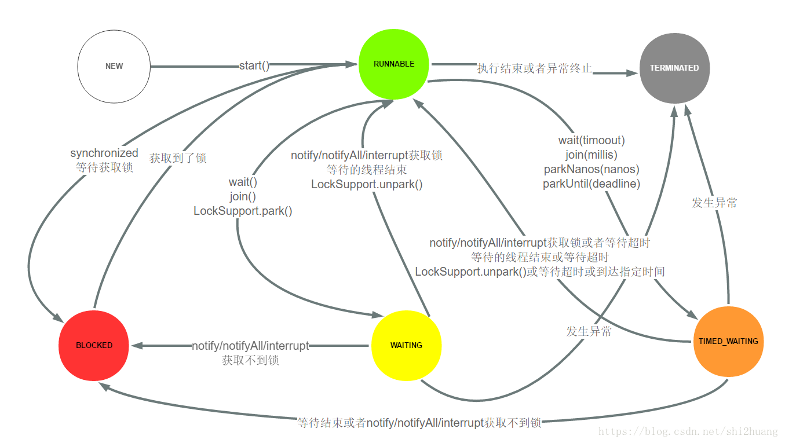
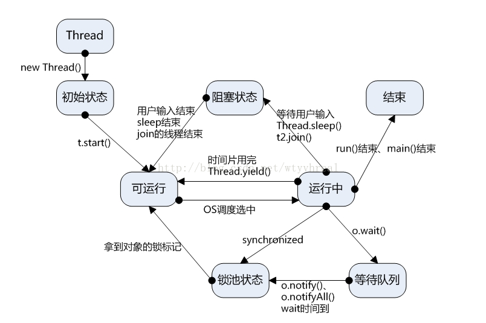
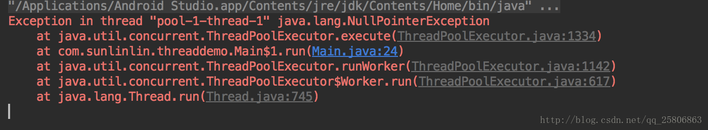
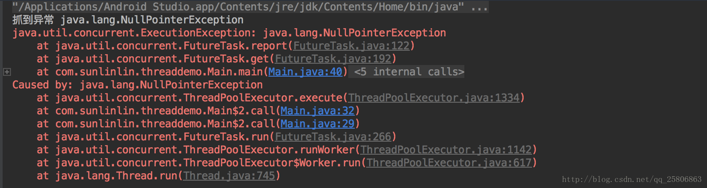

[TOC]

# Java 线程 Thread

## 创建线程的方式

### 继承Thread类

```
//继承Thread类来创建线程
public class ThreadTest {
 
    public static void main(String[] args) {
        //设置线程名字
        Thread.currentThread().setName("main thread");
        MyThread myThread = new MyThread();
        myThread.setName("子线程:");
        //开启线程
        myThread.start();
        for(int i = 0;i<5;i++){
            System.out.println(Thread.currentThread().getName() + i);
        }
    }
}
 
class MyThread extends Thread{
    //重写run()方法
    public void run(){
        for(int i = 0;i < 10; i++){
            System.out.println(Thread.currentThread().getName() + i);
        }
    }
}
```

缺点：

a. 每次new Thread新建对象性能差。 

b. 线程缺乏统一管理，可能无限制新建线程，相互之间竞争，及可能占用过多系统资源导致死机或oom。 

c. 缺乏更多功能，如定时执行、定期执行、线程中断。 

### 实现 Runnable接口

```
//实现Runnable接口
public class RunnableTest {
  
    public static void main(String[] args) {
        //设置线程名字
        Thread.currentThread().setName("main thread:");
        Thread thread = new Thread(new MyRunnable());
        thread.setName("子线程:");
        //开启线程
        thread.start();
        for(int i = 0; i <5;i++){
            System.out.println(Thread.currentThread().getName() + i);
        }
    }
}
  
class MyRunnable implements Runnable {
  
    @Override
    public void run() {
        for (int i = 0; i < 10; i++) {
            System.out.println(Thread.currentThread().getName() + i);
        }
    }
}
```

实现Runnable接口这种方式更受欢迎，因为这不需要继承Thread类。在应用设计中已经继承了别的对象的情况下，这需要多继承（而Java不支持多继承），只能实现接口。同时，线程池也是非常高效的，很容易实现和使用 

### **实现Callable接口** 

```
import java.util.concurrent.Callable;
import java.util.concurrent.ExecutionException;
import java.util.concurrent.FutureTask;
//实现Callable接口
public class CallableTest {
 
    public static void main(String[] args) {
        //执行Callable 方式，需要FutureTask 实现实现，用于接收运算结果
        FutureTask<Integer> futureTask = new FutureTask<Integer>(new MyCallable());
        new Thread(futureTask).start();
        //接收线程运算后的结果
        try {
            Integer sum = futureTask.get();
            System.out.println(sum);
        } catch (InterruptedException e) {
            e.printStackTrace();
        } catch (ExecutionException e) {
            e.printStackTrace();
        }
    }
}
 
class MyCallable implements Callable<Integer> {
 
    @Override
    public Integer call() throws Exception {
        int sum = 0;
        for (int i = 0; i < 100; i++) {
            sum += i;
        }
        return sum;
    }
}
```

 相较于实现Runnable 接口的实现，方法可以有返回值，并且抛出异常。 

### **线程池** 

```
import java.util.concurrent.ExecutorService;
import java.util.concurrent.Executors;
//线程池实现
public class ThreadPoolExecutorTest {
 
    public static void main(String[] args) {
        //创建线程池
        ExecutorService executorService = Executors.newFixedThreadPool(10);
        ThreadPool threadPool = new ThreadPool();
        for(int i =0;i<5;i++){
            //为线程池分配任务
            executorService.submit(threadPool);
        }
        //关闭线程池
        executorService.shutdown();
    }
}
 
class ThreadPool implements Runnable {
 
    @Override
    public void run() {
        for(int i = 0 ;i<10;i++){
            System.out.println(Thread.currentThread().getName() + ":" + i);
        }
    }

}
```

    线程池提供了一个线程队列，队列中保存着所有等待状态的线程。避免了创建与销毁额外开销，提交了响应速度。 

## 线程的同步synchronized

Synchronized是Java中解决并发问题的一种最常用的方法，也是最简单的一种方法。Synchronized的作用主要有三个：（1）确保线程互斥的访问同步代码（2）保证共享变量的修改能够及时可见（3）有效解决重排序问题。 

Java中每一个对象都可以作为锁，这是synchronized实现同步的基础： 

### 同步块

```
synchronized(this){
	System.out.println(Thread.currentThread().getName() + "抢到第[" + ticketCount + "]张票");
	ticketCount--;
}
```


### 同步方法

```
public static void add(){...}
```


### 静态同步方法
```
synchronized public static void add(){...}
```


### 锁方法的实质

1、普通同步方法，锁是当前实例对象 

2、静态同步方法，锁是当前类的class对象 

3、同步方法块，锁是括号里面的对象 


## 线程的常用方法

注：thread.方法()为线程实例对象调用

Thread.方法()为线程类Thread的静态方法

### thread.isAlive()

判断线程是否还活着

```
package com.thd.thread.api.t05alive;

public class Web1230605 extends Thread{
	private int ticketCount = 10;
	@Override
	public void run() {
		while(ticketCount>0) {
			try {
				Thread.sleep(1000);
			} catch (InterruptedException e) {
				// TODO Auto-generated catch block
				e.printStackTrace();
			}
			System.out.println(Thread.currentThread().getName() + "抢到第[" + ticketCount + "]张票");
			ticketCount--;
				
		}
	}
	
}

```


```
package com.thd.thread.api.t05alive;

public class Test05 {

	public static void main(String[] args) throws InterruptedException {
		System.out.println("Main Start ... ");
		Thread t = new Thread(new Web1230605(),"张三");
		System.out.println("01.Thread is alive ? " + t.isAlive() );
		t.start();
		System.out.println("02.Thread is alive ? " + t.isAlive() );
		System.out.println("03.Main is alive ?" + Thread.currentThread().isAlive());
		
		Thread.sleep(12000);
		System.out.println("04.Thread is alive ? " + t.isAlive() );
		System.out.println("Main End ... ");
	}
}

```

上例输出

```
Main Start ... 
01.Thread is alive ? false
02.Thread is alive ? true
03.Main is alive ?true
张三抢到第[10]张票
张三抢到第[9]张票
张三抢到第[8]张票
张三抢到第[7]张票
张三抢到第[6]张票
张三抢到第[5]张票
张三抢到第[4]张票
张三抢到第[3]张票
张三抢到第[2]张票
张三抢到第[1]张票
04.Thread is alive ? false
Main End ... 
```

### Thread.sleep()

- 让当前线程休眠指定时间。
- 休眠时间的准确性依赖于系统时钟和CPU调度机制。
- 不释放已获取的锁资源，如果sleep方法在同步上下文中调用，那么其他线程是无法进入到当前同步块或者同步方法中的。
- 可通过调用interrupt()方法来唤醒休眠线程。

### Object.wait()

- 让当前线程进入等待状态，当别的其他线程调用notify()或者notifyAll()方法时，当前线程进入就绪状态
- wait方法必须在同步上下文中调用，例如：同步方法块或者同步方法中，这也就意味着如果你想要调用wait方法，前提是必须获取对象上的锁资源
- 当wait方法调用时，**当前线程将会释放已获取的对象锁资源**，并进入等待队列，其他线程就可以尝试获取对象上的锁资源。 

### Object.wait(long s)

跟Object.wait()功能一样,只不过在s毫秒内如果没有被notify则自动唤醒

### Object.notify()

唤醒一个等待当前对象上的已wait的线程

### Object.notifyAll()

唤醒所有等待当前对象上的已wait的线程

### Thread.sleep() 与 Object.wait()的区别

|            | wait                                                         | sleep                                             |
| ---------- | ------------------------------------------------------------ | ------------------------------------------------- |
| 同步       | 只能在同步上下文中调用wait方法，否则或抛出IllegalMonitorStateException异常(只能在同步方法或同步块中调用 synchronized(lock){只能在这里调用}) | 不需要在同步方法或同步块中调用                    |
| 作用对象   | wait方法定义在Object类中，作用于对象本身                     | sleep方法定义在java.lang.Thread中，作用于当前线程 |
| 释放锁资源 | 是                                                           | 否                                                |
| 唤醒条件   | 其他线程调用对象的notify()或者notifyAll()方法                | 超时或者调用interrupt()方法体                     |
| 方法属性   | wait是实例方法                                               | sleep是静态方法                                   |

### thread.interrupt()

该方法并不能中断线程，而是做了一个中断标记，可以用Thread.intterupted()方法判断**当前**的线程是否已打上中断标记。这里的`当前`线程指的是执行Thread.intterupted()的线程（也就是说Thread.intterupted() 相当于 Thread.currentThread().interrupted()）。

**注意：**如果被标记中断的线程正处在sleep则会抛出异常并且中断标记被清除，如果某线程被标记为中断状态后进入sleep，则也会抛出异常并且中断标记被清除！


### Thread.interrupted()

判断当前线程是否已打上中断标记(是否执行过interrupt()方法打了中断标记)，并且清除当前线程的中断标记。


### thread.isInterrupted()

判断当前线程是否已打上中断标记(是否执行过interrupt()方法打了中断标记)


### thread.interrupt() 、 thread.interrupted() 、Thread.isInterrupted()区别

|              | thread.interrupt()                                           | Thread.interrupted()                                         | Thread.isInterrupted()                                |
| ------------ | ------------------------------------------------------------ | ------------------------------------------------------------ | ----------------------------------------------------- |
| 调用对象     | 线程实例对象(thread.interrupt())                             | 线程类(Thread.interrupted())                                 | 线程实例对象(thread.isInterrupted())                  |
| 功能         | 给调用interrupt()方法的线程打上中断标记                      | 判断正在执行的当前线程(Thread.currentThread)是否已打上中断标记，并清空该标记 | 判断调用isInterrupted方法的线程实例是否已打上中断标记 |
| 是否清空标记 | 不涉及                                                       | 是                                                           | 否                                                    |
| 备注         | 如果线程在sleep过程中被标记为中断则抛出异常且清空中断状态，如果被标记为中断状态的线程进行sleep则也会抛出异常且清除中断状态 |                                                              |                                                       |
|              |                                                              |                                                              |                                                       |


### Thread.yield()

放弃当前的CPU资源，让CPU执行其他的任务（有可能一个线程刚执行了Thread.yield()方法让出CPU后马上又获得了CPU的执行权），但是执行yield()方法不会释放持有的锁

## 线程的状态切换

### 新建（New）

创建后尚未启动。

### 可运行（Runnable）

可能正在运行，也可能正在等待 CPU 时间片。

包含了操作系统线程状态中的 Running 和 Ready。

### 阻塞（Blocking）

等待获取一个排它锁，如果其线程释放了锁就会结束此状态。

### 无限期等待（Waiting）

等待其它线程显式地唤醒，否则不会被分配 CPU 时间片。

| 进入方法                                   | 退出方法                             |
| ------------------------------------------ | ------------------------------------ |
| 没有设置 Timeout 参数的 Object.wait() 方法 | Object.notify() / Object.notifyAll() |
| 没有设置 Timeout 参数的 Thread.join() 方法 | 被调用的线程执行完毕                 |
| LockSupport.park() 方法                    | -                                    |

### 限期等待（Timed Waiting）

无需等待其它线程显式地唤醒，在一定时间之后会被系统自动唤醒。

调用 Thread.sleep() 方法使线程进入限期等待状态时，常常用“使一个线程睡眠”进行描述。

调用 Object.wait() 方法使线程进入限期等待或者无限期等待时，常常用“挂起一个线程”进行描述。

| 进入方法                                 | 退出方法                                        |
| ---------------------------------------- | ----------------------------------------------- |
| Thread.sleep() 方法                      | 时间结束                                        |
| 设置了 Timeout 参数的 Object.wait() 方法 | 时间结束 / Object.notify() / Object.notifyAll() |
| 设置了 Timeout 参数的 Thread.join() 方法 | 时间结束 / 被调用的线程执行完毕                 |
| LockSupport.parkNanos() 方法             | -                                               |
| LockSupport.parkUntil() 方法             | -                                               |

### 死亡（Terminated）

可以是线程结束任务之后自己结束，或者产生了异常而结束。

### 线程的状态转换



# 线程本地变量 ThreadLocal

## 用途

并发应用的一个关键地方就是**共享数据**。如果你创建一个类对象，实现Runnable接口，然后多个Thread对象使用同样的Runnable对象，全部的线程都共享同样的属性。这意味着，如果你在一个线程里改变一个属性，全部的线程都会受到这个改变的影响。

​     有时，你希望程序里的各个线程的属性不会被共享。 Java 并发 API提供了一个很清楚的机制叫本地线程变量即**ThreadLocal**。

​     模拟ThreadLocal类实现：线程范围内的共享变量，每个线程只能访问他自己的，不能访问别的线程。


## 例子

MyThreadLocal.java 自定义了一个ThreadLocal,主要是测试初始化值
```
package com.thd.thread.api.t12threadlocal.threadlocal;

/**
 * 定义一个ThreadLocal
 * 该ThreadLocal可以通过实现initialValue()方法初始化自定义的ThreadLocal的值
 * @author devil13th
 *
 */
public class MyThreadLocal extends ThreadLocal<String>{

	@Override
	protected String initialValue(){
	    System.out.println("调用get方法时，当前线程共享变量没有设置，调用initialValue获取默认值！");
	    return "init";
	}
		
}
```

ThreadVar.java  该类定义了一些普通的ThreadLocal和上面自定义的ThreadLocal

```
package com.thd.thread.api.t12threadlocal.threadlocal;

import java.util.Map;

public class ThreadVar {
	//定义一个类型为String的ThreadLocal
	public static ThreadLocal<String> tds = new ThreadLocal<String>();
	//定义一个类型为Map<String,Integer>的ThreadLocal
	public static ThreadLocal<Map<String,Integer>> tdm = new ThreadLocal<Map<String,Integer>>();
	//使用自定义的ThreadLocal,可以初始化该ThreadLocal的值
	public static ThreadLocal<String> mtl = new MyThreadLocal();
}

```

Thread01.java 

```
package com.thd.thread.api.t12threadlocal.threadlocal;

import java.util.HashMap;

public class Thread01 implements Runnable {
	
	@Override
	public void run() {
		//ThreadVar.mtl是自定义带有初始值的ThreadLocal
		System.out.println(Thread.currentThread().getName() + " 线程初始化的MyThreadLocal为" + ThreadVar.mtl.get());
		ThreadVar.tdm.set(new HashMap<String,Integer>());
		for(int i = 0 , j = 5 ; i < j ; i++){
			ThreadVar.tds.set(Thread.currentThread().getName() + "_" + i);
			System.out.println(ThreadVar.tds.get());
			ThreadVar.tdm.get().put((Thread.currentThread().getName() + "_" + i),Integer.valueOf(i));
			try {
				Thread.sleep(100);
			} catch (InterruptedException e) {
				// TODO Auto-generated catch block
				e.printStackTrace();
			}
		}
		System.out.println(ThreadVar.tdm.get());
		ThreadVar.tdm.remove();
	}
}

```

T01.java

```
package com.thd.thread.api.t12threadlocal.threadlocal;

public class T01 {

	public static void main(String[] args) {
		Thread01 t01 = new Thread01();
		Thread01 t02 = new Thread01();
		Thread t1 = new Thread(t01,"t1");
		Thread t2 = new Thread(t02,"t2");
		
		t1.start();
		t2.start();

	}

}

```

运行T01.java，结果如下

```
调用get方法时，当前线程共享变量没有设置，调用initialValue获取默认值！
t1 线程初始化的MyThreadLocal为init
调用get方法时，当前线程共享变量没有设置，调用initialValue获取默认值！
t2 线程初始化的MyThreadLocal为init
t2_0
t1_0
t2_1
t1_1
t2_2
t1_2
t2_3
t1_3
t2_4
t1_4
{t1_3=3, t1_2=2, t1_4=4, t1_1=1, t1_0=0}
{t2_2=2, t2_1=1, t2_4=4, t2_3=3, t2_0=0}
```

可以看到MyTheadLocal定义的ThreadLocal(tds)在初始化的时候已经有值了。ThreadLocal(tds,tdm,tdl)在t01和t02线程中是独立的副本,每个ThreadLocal在线程中获取或设置的值是互相独立,互不影响的。

## 原理

那么到底ThreadLocal类是如何实现这种“为每个线程提供不同的变量拷贝”的呢？先来看一下ThreadLocal的set()方法的源码是如何实现的 。

```
/**
     * Sets the current thread's copy of this thread-local variable
     * to the specified value.  Most subclasses will have no need to 
     * override this method, relying solely on the {@link #initialValue}
     * method to set the values of thread-locals.
     *
     * @param value the value to be stored in the current thread's copy of
     *        this thread-local.
     */
    public void set(T value) {
        Thread t = Thread.currentThread(); //获取到当前线程
        ThreadLocalMap map = getMap(t); //获取当前线程的ThreadLocalMap
        if (map != null) 
            map.set(this, value);
        else
            createMap(t, value);
    }
```

首先通过getMap(Thread t)方法获取一个和当前线程相关的ThreadLocalMap，然后将变量的值设置到这个ThreadLocalMap对象中，当然如果获取到的ThreadLocalMap对象为空，就通过createMap方法创建。 线程隔离的秘密，就在于ThreadLocalMap这个类。ThreadLocalMap是ThreadLocal类的一个静态内部类，它实现了键值对的设置和获取（对比Map对象来理解），每个线程中都有一个独立的ThreadLocalMap副本，它所存储的值，只能被当前线程读取和修改。ThreadLocal类通过操作每一个线程特有的ThreadLocalMap副本，从而实现了变量访问在不同线程中的隔离。因为每个线程的变量都是自己特有的，完全不会有并发错误。还有一点就是，ThreadLocalMap存储的键值对中的键是this对象指向的ThreadLocal对象，而值就是你所设置的对象了。 

为了加深理解，我们接着看上面代码中出现的getMap和createMap方法的实现： 

```
ThreadLocalMap getMap(Thread t) {
	return t.threadLocals; //返回的是参数中t线程的一个属性
}
void createMap(Thread t, T firstValue) {
	//创建一个ThreadLocalMapbing，将该ThreadLocalMapbing赋给t线程
	t.threadLocals = new ThreadLocalMap(this, firstValue); 
}
```

代码已经说的非常直白，就是获取和设置Thread内的一个叫threadLocals的变量，而这个变量的类型就是ThreadLocalMap，这样进一步验证了上文中的观点：每个线程都有自己独立的ThreadLocalMap对象。打开java.lang.Thread类的源代码，我们能得到更直观的证明： 

```
/* ThreadLocal values pertaining to this thread. This map is maintained
     * by the ThreadLocal class. */
    ThreadLocal.ThreadLocalMap threadLocals = null;
```

那么接下来再看一下ThreadLocal类中的get()方法，代码是这么说的： 

```
/**
     * Returns the value in the current thread's copy of this
     * thread-local variable.  If the variable has no value for the
     * current thread, it is first initialized to the value returned
     * by an invocation of the {@link #initialValue} method.
     *
     * @return the current thread's value of this thread-local
     */
    public T get() {
        Thread t = Thread.currentThread();
        ThreadLocalMap map = getMap(t);
        if (map != null) {
            ThreadLocalMap.Entry e = map.getEntry(this);
            if (e != null)
                return (T)e.value;
        }
        return setInitialValue();
    }

    /**
     * Variant of set() to establish initialValue. Used instead
     * of set() in case user has overridden the set() method.
     *
     * @return the initial value
     */
    private T setInitialValue() {
        T value = initialValue();
        Thread t = Thread.currentThread();
        ThreadLocalMap map = getMap(t);
        if (map != null)
            map.set(this, value);
        else
            createMap(t, value);
        return value;
    }
```

这两个方法的代码告诉我们，在获取和当前线程绑定的值时，**ThreadLocalMap对象是以this指向的ThreadLocal对象为键进行查找的**，这当然和前面set()方法的代码是相呼应的。

进一步地，我们可以创建不同的ThreadLocal实例来实现多个变量在不同线程间的访问隔离，为什么可以这么做？因为不同的ThreadLocal对象作为不同键，当然也可以在线程的ThreadLocalMap对象中设置不同的值了。通过ThreadLocal对象，在多线程中共享一个值和多个值的区别，就像你在一个HashMap对象中存储一个键值对和多个键值对一样，仅此而已。

设置到这些线程中的隔离变量，会不会导致内存泄漏呢？ThreadLocalMap对象保存在Thread对象中，当某个线程终止后，存储在其中的线程隔离的变量，也将作为Thread实例的垃圾被回收掉，所以完全不用担心内存泄漏的问题。在多个线程中隔离的变量，光荣的生，合理的死，真是圆满，不是么？

最后再提一句，ThreadLocal变量的这种隔离策略，也不是任何情况下都能使用的。如果多个线程并发访问的对象实例只允许，也只能创建那么一个，那就没有别的办法了，老老实实的使用同步机制来访问吧。

## 原理总结

调用ThreadLocal.get()的时候该方法过程如下

1. 获取当前线程
2. 通过当前线程获取该线程的ThreadLocalMap（先可以理解为一个Map）
3. 该ThreadLocalMap是一个键值对数组，ThreadLocal实例对象为键值对(Entry)的键，通过ThreadLocal的实例(this)获取该键，返回该键对应的值


## InheritableThreadLocal 可继承的ThreadLocal

子线程是可以继承父线程的ThreadLocal的，使用的是InheritableThreadLocal，该类继承了ThreadLocal并实现了

InheritableThreadLocal.java

```
public class InheritableThreadLocal<T> extends ThreadLocal<T> {
    ...
    ThreadLocalMap getMap(Thread t) {
       return t.inheritableThreadLocals;
    }
    void createMap(Thread t, T firstValue) {
        t.inheritableThreadLocals = new ThreadLocalMap(this, firstValue);
    }
    ...
    
}
```

再来看一下Thread类中的两个属性

Thread.java

```
    /* ThreadLocal values pertaining to this thread. This map is maintained
     * by the ThreadLocal class. */ 
     //线程自己的threadLocals
    ThreadLocal.ThreadLocalMap threadLocals = null;

    /*
     * InheritableThreadLocal values pertaining to this thread. This map is
     * maintained by the InheritableThreadLocal class.
     */
     //用于继承父类的threadLocals
    ThreadLocal.ThreadLocalMap inheritableThreadLocals = null;
```

再来看一下getMap方法

```
ThreadLocalMap getMap(Thread t) {
	return t.inheritableThreadLocals;
}
```

可以看到通过getMap(Thread t)方法调用的时候，返回的是线程的inheritableThreadLocals属性，该方法复写了ThreadLocal类的getMap(Thread t)方法，所以当使用InheritableThreadLocals类创建的本地线程变量实例调用get方法的时候，get方法内部调用getMap方法返回的是 线程的inheritableThreadLocals属性

## 例子

ThreadVar.java 定义了一个可以继承父线程的ThreadLocal（InheritableThreadLocal）

```
package com.thd.thread.api.t12threadlocal.inheritablethreadlocal;

public class ThreadVar {
	//可以继承父线程的ThreadLocal
	public static InheritableThreadLocal<String> itl = new InheritableThreadLocal<String>();
}

```

ThreadParent.java 父线程定义,该线程执行的时候会创建一个子线程

```
package com.thd.thread.api.t12threadlocal.inheritablethreadlocal;

public class ThreadParent implements Runnable{
	
	public void run(){
		//父线程对ThreadVar.itl赋值
		ThreadVar.itl.set("我是父线程" + Thread.currentThread().getName() + "设置的ThreadLocal" );
		System.out.println(Thread.currentThread().getName() + ":" +ThreadVar.itl.get());
		
		//创建并启动子线程
		Thread t = new Thread(new ThreadChild());
		t.setName("Child Thread");
		t.start();
	}
}


```

ThreadChild.java  子线程

```
package com.thd.thread.api.t12threadlocal.inheritablethreadlocal;

public class ThreadChild implements Runnable{
	
	public void run(){
		//子线程中直接调用ThreadVar.itl.get()方法可以直接获取父线程中设置的值
		System.out.println(Thread.currentThread().getName() + ":" + ThreadVar.itl.get());
	}
}

```

T01.java 测试类

```
package com.thd.thread.api.t12threadlocal.inheritablethreadlocal;

public class T01 {
	public static void main(String[] args) {
		Thread t = new Thread(new ThreadParent());
		t.setName("Parent Thread");
		t.start();
	}
}
```

打印结果如下：

```
Parent Thread:我是父线程Parent Thread设置的ThreadLocal
Child Thread:我是父线程Parent Thread设置的ThreadLocal
```

可以看到线程Child Thread(子线程)打印的值是父线程中设置的。


# 线程池 ThreadPool

## 使用线程池的好处

- 降低资源消耗

可以重复利用已创建的线程降低线程创建和销毁造成的消耗。

- 提高响应速度

当任务到达时，任务可以不需要等到线程创建就能立即执行。

- 提高线程的可管理性

线程是稀缺资源，如果无限制地创建，不仅会消耗系统资源，还会降低系统的稳定性，使用线程池可以进行统一分配、调优和监控

## 线程池的使用

### ThreadPoolExecutor的重要参数

线程池的构造方法如下

```
public ThreadPoolExecutor(int corePoolSize,
            　　　　　　　 int maximumPoolSize,
                          long keepAliveTime,
                          TimeUnit unit,
                          BlockingQueue<Runnable> workQueue,
                          ThreadFactory threadFactory,
                          RejectedExecutionHandler handler) 
```


- corePoolSize：核心线程数
  - 核心线程会一直存活，及时没有任务需要执行
  - 当线程数小于核心线程数时，即使有线程空闲，线程池也会优先创建新线程处理
  - 设置allowCoreThreadTimeout=true（默认false）时，核心线程会超时关闭
- maximumPoolSize：最大线程数
  - 当线程数>=corePoolSize，且任务队列已满时。线程池会创建新线程来处理任务
  - 当线程数=maxPoolSize，且任务队列已满时，线程池会拒绝处理任务而抛出异常
  - 当核心线程数达到最大时，新任务会放在队列中排队等待执行
- workQueue：任务队列容量（阻塞队列）
  - 当核心线程数达到最大时，新任务会放在队列中排队等待执行

- keepAliveTime：线程空闲时间

  - 当线程空闲时间达到keepAliveTime时，线程会退出，直到线程数量=corePoolSize
  - 如果allowCoreThreadTimeout=true，则会直到线程数量=0

- allowCoreThreadTimeout：允许核心线程超时 （ThreadPoolFactory.executor.allowCoreThreadTimeOut(true);）
- rejectedExecutionHandler：任务拒绝处理器
  - 两种情况会拒绝处理任务：
    1. 当线程数已经达到maxPoolSize，切队列已满，会拒绝新任务
    2. 当线程池被调用shutdown()后，会等待线程池里的任务执行完毕，再shutdown。如果在调用shutdown()和线程池真正shutdown之间提交任务，会拒绝新任务
  - 线程池会调用rejectedExecutionHandler来处理这个任务。如果没有设置默认是AbortPolicy，会抛出异常
  - ThreadPoolExecutor类有几个内部实现类来处理这类情况：
    1. AbortPolicy 丢弃任务，抛运行时异常
    2. CallerRunsPolicy 执行任务
    3. DiscardPolicy 忽视，什么都不会发生
    4. DiscardOldestPolicy 从队列中踢出最先进入队列（最后一个执行）的任务
  - 实现RejectedExecutionHandler接口，可自定义处理器

### ThreadPoolExecutor执行顺序

线程池按以下行为执行任务


- 当线程数小于核心线程数时，创建线程。
- 当线程数大于等于核心线程数，且任务队列未满时，将任务放入任务队列。
- 当线程数大于等于核心线程数，且任务队列已满则按照下面规则执行
  - 若线程数小于最大线程数，创建线程
  - 若线程数等于最大线程数，通过设置的任务拒绝处理器的策略执行

corePoolSize -> 任务队列 -> maximumPoolSize -> 拒绝策略 

### 如何设置参数

#### 默认值

- corePoolSize=1
- queueCapacity=Integer.MAX_VALUE
- maxPoolSize=Integer.MAX_VALUE
- keepAliveTime=60s
- allowCoreThreadTimeout=false
- rejectedExecutionHandler=AbortPolicy()

####  如何来设置
需要根据几个值来决定
- tasks ：每秒的任务数，假设为500~1000
- taskcost：每个任务花费时间，假设为0.1s
- responsetime：系统允许容忍的最大响应时间，假设为1s

做几个计算
- corePoolSize = 每秒需要多少个线程处理？ 
  - threadcount = tasks/(1/taskcost) =tasks*taskcout =  (500~1000)*0.1 = 50~100 个线程。corePoolSize设置应该大于50
  - 根据8020原则，如果80%的每秒任务数小于800，那么corePoolSize设置为80即可
- queueCapacity = (coreSizePool/taskcost)*responsetime
  - 计算可得 queueCapacity = 80/0.1*1 = 80。意思是队列里的线程可以等待1s，超过了的需要新开线程来执行
  - 切记不能设置为Integer.MAX_VALUE，这样队列会很大，线程数只会保持在corePoolSize大小，当任务陡增时，不能新开线程来执行，响应时间会随之陡增。
- maxPoolSize = (max(tasks)- queueCapacity)/(1/taskcost)
  -  计算可得 maxPoolSize = (1000-80)/10 = 92  
  -  （最大任务数-队列容量）/每个线程每秒处理能力 = 最大线程数
- rejectedExecutionHandler：根据具体情况来决定，任务不重要可丢弃，任务重要则要利用一些缓冲机制来处理
- keepAliveTime和allowCoreThreadTimeout采用默认通常能满足

以上都是理想值，实际情况下要根据机器性能来决定。如果在未达到最大线程数的情况机器cpu load已经满了，则需要通过升级硬件（呵呵）和优化代码，降低taskcost来处理。


## 几种常用的线程池的创建和原理

### newSingleThreadExecutor

创建一个单线程化的Executor，即只创建唯一的工作者线程来执行任务，它只会用唯一的工作线程来执行任务，保证所有任务按照指定顺序(FIFO, LIFO, 优先级)执行。如果这个线程异常结束，会有另一个取代它，保证顺序执行。单工作线程最大的特点是可保证顺序地执行各个任务，并且在任意给定的时间不会有多个线程是活动的。 

例子：

```
package com.thd.thread.api.t10threadpool;

import java.util.concurrent.ExecutorService;
import java.util.concurrent.Executors;

public class Test03NewSingleThreadExecutor {
	/**
	 * 创建一个顺序执行的线程池newSingleThreadExecutor
	 * 该线程中的线程顺序执行first in  first out 
	 * 始终只有最多1个线程再执行
	 */
	public static void main(String[] args) {
		
		ExecutorService es = Executors.newSingleThreadExecutor();
		
		for(int i = 0 , j = 18 ; i < j ; i++){
			Thread t = new Thread(new Thread01(i),"thread" + i);
			es.execute(t);
		}

	}

}
```


创建方法

```
public static ExecutorService newSingleThreadExecutor() {
        return new FinalizableDelegatedExecutorService
            (new ThreadPoolExecutor(1, 1,
                                    0L, TimeUnit.MILLISECONDS,
                                    new LinkedBlockingQueue<Runnable>()));
    }
```


### newFixedThreadPool
创建一个指定工作线程数量的线程池。每当提交一个任务就创建一个工作线程，如果工作线程数量达到线程池初始的最大数，则将提交的任务存入到池队列中。

FixedThreadPool是一个典型且优秀的线程池，它具有线程池提高程序效率和节省创建线程时所耗的开销的优点。但是，在线程池空闲时，即线程池中没有可运行任务时，它不会释放工作线程，还会占用一定的系统资源。

例子：

```
package com.thd.thread.api.t10threadpool;

import java.util.concurrent.ExecutorService;
import java.util.concurrent.Executors;

public class Test02NewFixedThreadPool {
	/**
	 * 创建一个线程数量是固定大小的线程池newFixedThreadPool
	 * 最多同时运行固定大小的任务,如果再有新任务则进入等待队列,
	 * 等运行的任务完成后,等待队列中的任务才会被执行(排队上厕所一样,出来一个后才能进来一个)
	 *
	 * 
	 */
	public static void main(String[] args) {
		//创建一个核心线程为3的固定大小线程池
		//最多有3个线程同时运行,如果再有新的线程进入必须等待
		//3个同时运行的线程中有运行完成的在去执行等待的线程
		//过程如下
		/**
		 * 任务1进入线程池,线程池中有3个空闲线程(线程1,线程2,线程3),用线程1执行任务1
		 * 任务2进入线程池,线程池中有2个空闲线程(线程2,线程3),用线程2执行任务2
		 * 任务3进入线程池,线程池中有1个空闲线程(线程3),用线程3执行任务3
		 * 任务4进入线程池,线程池中没有空闲线程,任务4等待
		 * 任务5进入线程池,线程池中没有空闲线程,任务5等待
		 * 任务1结束,线程1闲置
		 * 线程1执行任务4
		 * 任务2结束,线程2闲置
		 * 线程2执行任务5
		 */
		ExecutorService es = Executors.newFixedThreadPool(3);
		
		for(int i = 0 , j = 18 ; i < j ; i++){
			Thread t = new Thread(new Thread01(i),"thread" + i);
			
			es.execute(t);
		}

	}

}

```

创建方法

```
public static ExecutorService newFixedThreadPool(int nThreads) {
        return new ThreadPoolExecutor(nThreads, nThreads,
                                      0L, TimeUnit.MILLISECONDS,
                                      new LinkedBlockingQueue<Runnable>());
    }
```


### newCachedThreadPool

创建一个可缓存线程池，如果线程池长度超过处理需要，可灵活回收空闲线程，若无可回收，则新建线程。

这种类型的线程池特点是：

- 工作线程的创建数量几乎没有限制(其实也有限制的,数目为Interger. MAX_VALUE), 这样可灵活的往线程池中添加线程。
- 如果长时间没有往线程池中提交任务，即如果工作线程空闲了指定的时间(默认为1分钟)，则该工作线程将自动终止。终止后，如果你又提交了新的任务，则线程池重新创建一个工作线程。
- 在使用CachedThreadPool时，一定要注意控制任务的数量，否则，由于大量线程同时运行，很有会造成系统瘫痪。

例子：

```
package com.thd.thread.api.t10threadpool;

import java.util.concurrent.ExecutorService;
import java.util.concurrent.Executors;

public class Test01NewCachedThreadPool {
	/**
	 * 创建一个不限线程数上限的线程池newCachedThreadPool，任何提交的任务都将立即执行
	 * 执行前会先检查之前创建的线程是否有空闲(已经执行完任务的线程),如果有直接使用,如果没有则创建
	 * 
	 */
	public static void main(String[] args) {
		ExecutorService es = Executors.newCachedThreadPool();
		
		for(int i = 0 , j = 1000 ; i < j ; i++){
			Thread t = new Thread(new Thread01(i),"thread" + i);
			
			//打印出来的thread名称是线程池自己的名称 ,线程名称中并没有第999(pool-1-thread-999)个
			//因为在运行过程中虽然不断创建线程执行新的任务,
			//但也会有之前创建的线程完成了任务转为空闲线程,
			//这些空闲的线程会被复用 
			//过程如下：
			
			/*
			 * 任务1进到线程池中,查看线程池中是否有空闲线程,没有,则创建线程1
			 * 任务2进到线程池中,查看线程池中是否有空闲线程,没有,则创建线程2
			 * 任务3进到线程池中,查看线程池中是否有空闲线程,没有,则创建线程3
			 * 任务1运行完成,释放线程1
			 * 任务2运行完成,释放线程2
			 * 任务4进到线程池中,查看线程池中是否有空闲线程,有,则复用线程1
			 * 任务5进到线程池中,查看线程池中是否有空闲线程,有,则复用线程2
			 * ...
			 * 
			 */
			es.execute(t);
		}

	}

}

```

创建方法

```
public static ExecutorService newCachedThreadPool() {
        return new ThreadPoolExecutor(0, Integer.MAX_VALUE,
                                      60L, TimeUnit.SECONDS,
                                      new SynchronousQueue<Runnable>());
    }
```

### 线程池执行线程的返回值

一般使用线程池执行任务都是调用的execute方法，这个方法定义在Executor接口中： 

```
public interface Executor {
    void execute(Runnable command);
}
```

这个方法是没有返回值的，而且只接受Runnable。 

那么像得到线程的返回值怎嘛办呢？

在ExecutorService接口中能找到这个方法：

```
<T> Future<T> submit(Callable<T> task);
<T> Future<T> submit(Runnable task, T result);
Future<?> submit(Runnable task);
```

这个方法接收两种参数，Callable和Runnable。返回值是Future。

下面具体看一下这些是什么东西。

#### Callable和Runnable

先看一下两个接口的定义： 

- Callable

  ```
  public interface Callable<V> {
    V call() throws Exception;
  }123
  ```

- Runnable

  ```
  interface Runnable {
    public abstract void run();
  }
  ```
  
和明显能看到区别：

Callable能接受一个泛型，然后在call方法中返回一个这个类型的值。

而Runnable的run方法没有返回值

Callable的call方法可以抛出异常，而Runnable的run方法不会抛出异常。

#### Future

返回值Future也是一个接口，通过他可以获得任务执行的返回值。 

```
public interface Future<V> {
    boolean cancel(boolean var1);

    boolean isCancelled();

    boolean isDone();

    V get() throws InterruptedException, ExecutionException;

    V get(long var1, TimeUnit var3) throws InterruptedException, ExecutionException, TimeoutException;
}

```

其中的get方法获取的就是返回值。 

#### 例子

```
public class Main {
    public static void main(String[] args) throws InterruptedException, ExecutionException {
        ExecutorService executor = Executors.newFixedThreadPool(2);
        //创建一个Callable，3秒后返回String类型
        Callable myCallable = new Callable() {
            @Override
            public String call() throws Exception {
                Thread.sleep(3000);
                System.out.println("calld方法执行了");
                return "call方法返回值";
            }
        };
        System.out.println("提交任务之前 "+getStringDate());
        Future future = executor.submit(myCallable);
        System.out.println("提交任务之后，获取结果之前 "+getStringDate());
        System.out.println("获取返回值: "+future.get());
        System.out.println("获取到结果之后 "+getStringDate());
    }
    public static String getStringDate() {
        Date currentTime = new Date();
        SimpleDateFormat formatter = new SimpleDateFormat("HH:mm:ss");
        String dateString = formatter.format(currentTime);
        return dateString;
    }
}

```

**通过executor.submit提交一个Callable，返回一个Future，然后通过这个Future的get方法取得返回值。 **

看一下输出：
```
提交任务之前 12:13:01
提交任务之后，获取结果之前 12:13:01
calld方法执行了
获取返回值: call方法返回值
获取到结果之后 12:13:04
```

#### get()方法的阻塞性
通过上面的输出可以看到，在调用submit提交任务之后，主线程本来是继续运行了。但是运行到future.get()的时候就阻塞住了，一直等到任务执行完毕，拿到了返回的返回值，主线程才会继续运行。

这里注意一下，他的阻塞性是因为调用get()方法时，任务还没有执行完，所以会一直等到任务完成，形成了阻塞。

任务是在调用submit方法时就开始执行了，如果在调用get()方法时，任务已经执行完毕，那么就不会造成阻塞。

下面在调用方法前先睡4秒，这时就能马上得到返回值。

```
System.out.println("提交任务之前 "+getStringDate());
Future future = executor.submit(myCallable);
System.out.println("提交任务之后 "+getStringDate());
Thread.sleep(4000);
System.out.println("已经睡了4秒,开始获取结果 "+getStringDate());
System.out.println("获取返回值: "+future.get());
System.out.println("获取到结果之后 "+getStringDate());

```

```
提交任务之前 12:36:04
提交任务之后 12:36:04
calld方法执行了
已经睡了4秒,开始获取结果 12:36:08
获取返回值: call方法返回值
获取到结果之后 12:36:08
```

可以看到吗，因为睡了4秒，任务已经执行完毕，所以get方法立马就得到了结果。

同样的原因，submit两个任务时，总阻塞时间是最长的那个。

例如，有两个任务，一个3秒，一个5秒。

```
Callable myCallable = new Callable() {
    @Override
    public String call() throws Exception {
        Thread.sleep(5000);
        System.out.println("calld方法执行了");
        return "call方法返回值";
    }
};
Callable myCallable2 = new Callable() {
    @Override
    public String call() throws Exception {
        Thread.sleep(3000);
        System.out.println("calld2方法执行了");
        return "call2方法返回值";
    }
};
System.out.println("提交任务之前 "+getStringDate());
        Future future = executor.submit(myCallable);
        Future future2 = executor.submit(myCallable2);
        System.out.println("提交任务之后 "+getStringDate());
        System.out.println("开始获取第一个返回值 "+getStringDate());
        System.out.println("获取返回值: "+future.get());
        System.out.println("获取第一个返回值结束，开始获取第二个返回值 "+getStringDate());
        System.out.println("获取返回值2: "+future2.get());
        System.out.println("获取第二个返回值结束 "+getStringDate());

```

输出
```
提交任务之前 14:14:47
提交任务之后 14:14:48
开始获取第一个返回值 14:14:48
calld2方法执行了
calld方法执行了
获取返回值: call方法返回值
获取第一个返回值结束，开始获取第二个返回值 14:14:53
获取返回值2: call2方法返回值
获取第二个返回值结束 14:14:53
```

获取第一个结果阻塞了5秒，所以获取第二个结果立马就得到了。 

#### submit(Runnable task)

因为Runnable是没有返回值的，所以如果submit一个Runnable的话，get得到的为null： 

```
Runnable myRunnable = new Runnable() {
    @Override
    public void run() {
        try {
            Thread.sleep(2000);
            System.out.println(Thread.currentThread().getName() + " run time: " + System.currentTimeMillis());
        } catch (InterruptedException e) {
            e.printStackTrace();
        }
    }
};

Future future = executor.submit(myRunnable);
        System.out.println("获取的返回值： "+future.get());

```

输出为： 

```
pool-1-thread-1 run time: 1493966762524
获取的返回值： null
```

#### submit(Runnable task, T result)

虽然submit传入Runnable不能直接返回内容，但是可以通过`submit(Runnable task, T result)`传入一个载体，通过这个载体获取返回值。这个其实不能算返回值了，是交给线程处理一下。

先新建一个载体类Data：

```
public static class Data {
    String name;
    String sex;

    public String getName() {
        return name;
    }

    public void setName(String name) {
        this.name = name;
    }

    public String getSex() {
        return sex;
    }

    public void setSex(String sex) {
        this.sex = sex;
    }
}

```

然后在Runnable的构造方法中传入： 

```
static class MyThread implements Runnable {
    Data data;

    public MyThread(Data name) {
        this.data = name;
    }

    @Override
    public void run() {
        try {
            Thread.sleep(2000);
            System.out.println("线程  执行:");
            data.setName("新名字");
            data.setSex("新性别");
        } catch (InterruptedException e) {
            e.printStackTrace();
        }
    }
}
```


然后调用：
```
Data data = new Data();
Future<Data> future = executor.submit(new MyThread(data), data);
System.out.println("返回的结果  name: " + future.get().getName()+", sex: "+future.get().getSex());
System.out.println("原来的Data  name: " + data.getName()+", sex: "+data.getSex());
```
输出：
```
线程  执行:
返回的结果  name: 新名字, sex: 新性别
原来的Data  name: 新名字, sex: 新性别
```
发现原来的data也变了。

#### get(long var1, TimeUnit var3)

前面都是用的get()方法获取返回值，那么因为这个方法是阻塞的，有时需要等很久。所以有时候需要设置超时时间。

get(long var1, TimeUnit var3)这个方法就是设置等待时间的。

如下面的任务需要5秒才能返回结果：

```
Callable myCallable = new Callable() {
    @Override
    public String call() throws Exception {
        Thread.sleep(5000);
        return "我是结果";
    }
};
```

使用get: 

```
Future future1 = executor.submit(myCallable);
System.out.println("开始拿结果 "+getStringDate());
System.out.println("返回的结果是： "+future1.get()+ " "+getStringDate());
System.out.println("结束拿结果 "+getStringDate());
```

输出是： 

```
开始拿结果 16:00:43
返回的结果是： 我是结果 16:00:48
结束拿结果 16:00:48
```

现在要求最多等3秒，拿不到返回值就不要了，所以用`get(long var1, TimeUnit var3)`这个方法

方法的第一个参数是长整形数字，第二个参数是单位，跟线程池ThreadPoolExecutor的构造方法里一样的。

```
Future future1 = executor.submit(myCallable);
System.out.println("开始拿结果 "+getStringDate());
try {
    System.out.println("返回的结果是： "+future1.get(3, TimeUnit.SECONDS)+ " "+getStringDate());
} catch (TimeoutException e) {
    e.printStackTrace();
    System.out.println("超时了 "+getStringDate());
}
System.out.println("结束拿结果 "+getStringDate());
```

然后输出是 


过了三秒就抛出超时异常了，主线程继续运行，不会再继续阻塞。 

#### 异常

使用submit方法还有一个特点就是，他的异常可以在主线程中catch到。

而使用execute方法执行任务是捕捉不到异常的。

用下面这个Runnable来说,这个 里面一定会抛出一个异常

```
Runnable myRunnable = new Runnable() {
    @Override
    public void run() {
        executor.execute(null);
    }
};
```

#### 使用execute

这里如果捕捉到异常，只打印一行异常信息。 

```
try {
	executor.execute(myRunnable);
} catch (Exception e) {
	e.printStackTrace();
	System.out.println("抓到异常 "+e.getMessage());
}
```

输出 



并没有出现抓到异常哪行日志。而且这个异常输出是在线程`pool-1-thread-1`中，并不是在主线程中。说明主线程的catch不能捕捉到这个异常。 

#### 使用submit

```
try {
	Future future1= executor.submit(myCallable);
	future1.get();
} catch (Exception e) {
	e.printStackTrace();
	System.out.println("抓到异常 "+e.getMessage());
}
```

输出 



这个就能抓到异常了。 


### 总结

其实上面几种线程池的创建过程归根到底都是通过Executors的静态方法来创建ThreadPoolExecutor