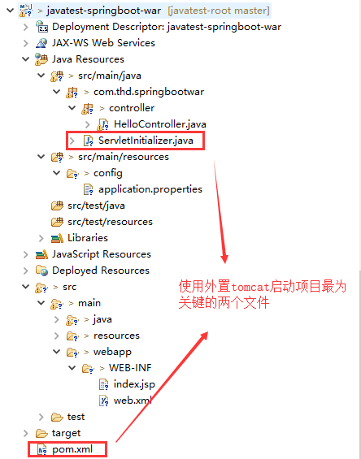

[toc]
# 使用外置tomcat启动spring boot项目


## 项目文件目录结构


## 创建pom.xml

- 创建pom.xml
- 继承spring-boot-starter-parent
- 依赖spring-boot-starter-web
- <span style="color:red">**去掉spring-boot-starter-tomcat**</span>

```
<project xmlns="http://maven.apache.org/POM/4.0.0" xmlns:xsi="http://www.w3.org/2001/XMLSchema-instance"
	xsi:schemaLocation="http://maven.apache.org/POM/4.0.0 http://maven.apache.org/xsd/maven-4.0.0.xsd">
	<modelVersion>4.0.0</modelVersion>

	<parent>
		<groupId>org.springframework.boot</groupId>
		<artifactId>spring-boot-starter-parent</artifactId>
		<version>1.5.12.RELEASE</version>
	</parent>


	<groupId>com-thd-javatest</groupId>
	<artifactId>javatest-springboot-war</artifactId>
	<version>0.0.1-SNAPSHOT</version>
	<packaging>war</packaging>
	
	
	<dependencies>
		<dependency>
			<groupId>org.springframework.boot</groupId>
			<artifactId>spring-boot-starter-web</artifactId>
		</dependency>
		<!--声明spring boot内嵌tomcat的作用范围 在运行时不起作用 -->
		<dependency>
			<groupId>org.springframework.boot</groupId>
			<artifactId>spring-boot-starter-tomcat</artifactId>
			<scope>provided</scope>
		</dependency>
	</dependencies>
	
	
</project>
```

注意：
```
<dependency>
	<groupId>org.springframework.boot</groupId>
	<artifactId>spring-boot-starter-tomcat</artifactId>
	<scope>provided</scope>
</dependency>
```
编译后的war是没有spring-boot-starter-tomcat的

## 创建启动类

- 创建启动类ServletInitializer
- <span style="color:red">**继承SpringBootServletInitializer **</span> 
- <span style="color:red">**重写 `SpringApplicationBuilder configure(SpringApplicationBuilder builder)` 方法 **</span>
- 创建主方法 public static void main(String[] args)

```
package com.thd.springbootwar;

import org.springframework.boot.SpringApplication;
import org.springframework.boot.autoconfigure.SpringBootApplication;
import org.springframework.boot.builder.SpringApplicationBuilder;
import org.springframework.boot.web.support.SpringBootServletInitializer;
import org.springframework.context.annotation.PropertySource;
@SpringBootApplication  //启动类  
@PropertySource(value={"classpath:config/application.properties"},encoding="utf-8") //配置文件位置
public class ServletInitializer extends SpringBootServletInitializer {

	@Override
	protected SpringApplicationBuilder configure(
			SpringApplicationBuilder builder) {
		// TODO Auto-generated method stub
		
		System.out.println("-----------------");
		return builder.sources(this.getClass());
	}
	
	public static void main(String[] args) {
		SpringApplication.run(ServletInitializer.class, args);
	}

}
```

## 创建配置文件

```
# 开启spring boot debug模式
debug=true


#服务端口号(使用springboot内置容器启动时才起作用)
server.port=8888
#根目录(使用springboot内置容器启动时才起作用)
server.servlet.context-path=/sbt


# mvc jsp前缀
spring.mvc.view.prefix=/WEB-INF/
# mvc jsp后缀
spring.mvc.view.suffix=.jsp

```

## 创建Spring MVC相关资源

### 创建Controller

```
package com.thd.springbootwar.controller;

import java.util.HashMap;
import java.util.Map;

import org.springframework.stereotype.Controller;
import org.springframework.web.bind.annotation.RequestMapping;
import org.springframework.web.bind.annotation.RequestMethod;
import org.springframework.web.servlet.ModelAndView;

@Controller
@RequestMapping(value = "/Hello")
public class HelloController {
	@RequestMapping(value="/hello",method=RequestMethod.GET)
	public ModelAndView hello(String name){
		System.out.println(name);
		Map m = new HashMap();
		m.put("name", name);
		return new ModelAndView("index",m);
	}
}

```

### 创建index.jsp

```
<%@ page language="java" contentType="text/html; charset=utf-8" pageEncoding="utf-8"%>
<!DOCTYPE html PUBLIC "-//W3C//DTD HTML 4.01 Transitional//EN" "http://www.w3.org/TR/html4/loose.dtd">
<html>
<head>
<meta http-equiv="Content-Type" content="text/html; charset=utf-8">
<title>1234</title>
<link rel='stylesheet'  href="<%=request.getContextPath() %>/webjars/bootstrap/3.3.6/css/bootstrap.min.css"/>

<script type="text/javascript" src="<%=request.getContextPath() %>/webjars/bootstrap/3.3.6/js/bootstrap.min.js"></script>

<script type="text/javascript" src="<%=request.getContextPath() %>/webjars/jquery/2.2.4/jquery.min.js"></script>

<script>
</script>
</head>
<body>
<div id="a">hello : ${name}</div>
</body>
</html>
```

## 创建web.xml

```
<?xml version="1.0" encoding="UTF-8"?>
<web-app xmlns:xsi="http://www.w3.org/2001/XMLSchema-instance" xmlns:web="http://java.sun.com/xml/ns/javaee" xmlns="http://java.sun.com/xml/ns/javaee" xsi:schemaLocation="http://java.sun.com/xml/ns/javaee http://java.sun.com/xml/ns/javaee/web-app_2_5.xsd" id="WebApp_ID" version="2.5">
  <display-name>thdbaseframe</display-name>
  <welcome-file-list>
    <welcome-file>index.html</welcome-file>
    <welcome-file>index.htm</welcome-file>
    <welcome-file>index.jsp</welcome-file>
    <welcome-file>default.html</welcome-file>
    <welcome-file>default.htm</welcome-file>
    <welcome-file>default.jsp</welcome-file>
  </welcome-file-list>
</web-app>
```

## 访问地址

`http://127.0.0.1:8000/javatest-springboot-war/Hello/hello?name=devil13th`
注意：地址中的端口号`8000`和项目根目录`javatest-springboot-war`是tomcat容器server.xml文件中配置的内容,而不是项目中application.properties中配置的`server.port` 和 `server.servlet.context-path`

## 总结

用外置tomcat启动项目跟内置tomcat启动区别：

- 启动类需要继承 SpringBootServletInitializer 并重写其 `configure()` 方法
- 去掉spring-boot-starter-tomcat依赖 


