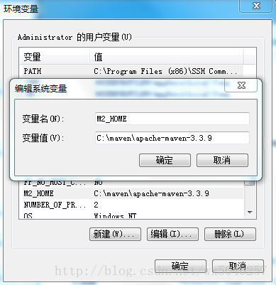
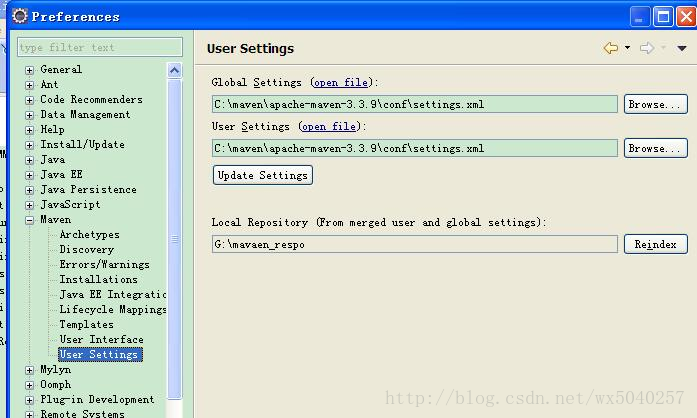

[toc]
# eclipse+maven搭建web项目

## 前言

用maven我们能做什么，有什么好处？

用maven，我们可以方便统一的进行jar包管理，jar包版本升级，快速项目构建以及分模块开发等相关功能。maven使用得好，项目开发速度就会成倍的提升。总之，项目越大，越能体现maven的优势。

## 软件环境

- Eclipse JavaEE IDE，版本代号：Mars.2Release (4.5.2)
- apache-maven-3.3.9
- JDK1.7
- apache-tomcat-7.0.29。

## maven安装配置

解压缩apache-maven-3.3.9-bin.tar.gz到本地，如图所示  
  

### 配置环境变量(如果你不想脱离开发环境运行项目，此处非必须)：  
  

  

打开conf/settings.xml文件做如下配置

#### 配置本地仓库位置

  

#### 配置中央仓库镜像库
即配置jar包的下载镜像(建议配置阿里巴巴的镜像，下载速度超快)

 

#### 设置maven相关参数

首先添加一个本地maven，如图所示:  
 

然后配置UserSettings:


接下来，配置tomcat  
点击菜单 File -> new -> other...
在弹出的界面中找到server,如图所示  

选择tomcat,如果本地没有则需要新增(点击add),配置好后点击Finish,如下图


新增的tomcat如下图 


打开server双击tomcat可以进行以下设置
- Publishing : 项目发布类型，建议修改后发布(Automatically publish when resources change)
- Timeouts ： 项目启动超时设置
- Ports ： 服务端口号配置

以上配置均体现到server.xml中(左侧目录菜单中Servers/Tomcat v... /server.xml)


Ok,配置工作就此结束

## Eclipse+Maven创建webapp项目

1、开启eclipse，右键new――》other，如下图找到maven project


2、选择maven project，显示创建maven项目的窗口，勾选如图所示，Create a simple project括号后面的skip archetype selection表示跳过骨架，骨架表示一些创建模板，这里我们不使用模板更加简单。  


3、输入maven项目的基本信息，如果是web工程，在Packaging栏我们要选择war，如下图所示：  


4、完成maven项目的创建，生成相应的maven项目结果，如下所示：
  

创建完成之后项目会报错，报错是因为webapp目录下没有web.xml。我们随便从其它web工程里面拷贝WEB-INF目录过来即可，完成后如图：  
 

错误立马消失。

5、接下来拷贝下面这段代码到pom.xml里面，用来确定项目的jdk编译版本：

```
<build>
   <plugins>
     <plugin>
       <groupId>org.apache.maven.plugins</groupId>
       <artifactId>maven-compiler-plugin</artifactId>
       <version>3.5.1</version>
        <configuration>
         <source>1.7</source>
         <target>1.7</target>
         <encoding>utf-8</encoding>
       </configuration>
     </plugin>
   </plugins>
</build>
```
如图所示：

 

这时候，项目又会报错，我们配置完成后，需要执行一次更新项目配置的动作。选中项目 --> 右键 -->Maven --> Update Project（eclipseluna 版本，helios 或indigo 版本选择 Update Project Configuration）。更新完成之后，错误消失，jdk版本也更改过来了，如图所示：

 

6、在pom.xml中添加jar包依赖

例如添加spring-core,应该是
```
<dependency>
    <groupId>org.springframework</groupId>
    <artifactId>spring-core</artifactId>
    <version>3.2.2.RELEASE</version>
</dependency>
```
不知道写怎么办？ 百度搜索maven spring-core repository    然后选择旁边的版本号,如图所示：

 

点击3.2.2，就可以直接复制出来了

 

附录：spring+springmvc+mybatis整合开发包依赖配置

```
<dependencies>

    <!--spring3.2.2 start-->

    <dependency>

    <groupId>org.springframework</groupId>

    <artifactId>spring-core</artifactId>

    <version>3.2.2.RELEASE</version>

    </dependency>

    <dependency>

        <groupId>org.springframework</groupId>

        <artifactId>spring-beans</artifactId>

        <version>3.2.2.RELEASE</version>

    </dependency>

    <dependency>

        <groupId>org.springframework</groupId>

        <artifactId>spring-context</artifactId>

        <version>3.2.2.RELEASE</version>

    </dependency>

    <dependency>

        <groupId>org.springframework</groupId>

        <artifactId>spring-aop</artifactId>

        <version>3.2.2.RELEASE</version>

    </dependency>

    <dependency>

        <groupId>org.springframework</groupId>

        <artifactId>spring-expression</artifactId>

        <version>3.2.2.RELEASE</version>

    </dependency>

    <dependency>

        <groupId>org.springframework</groupId>

        <artifactId>spring-web</artifactId>

        <version>3.2.2.RELEASE</version>

    </dependency>

    <dependency>

        <groupId>org.springframework</groupId>

        <artifactId>spring-webmvc</artifactId>

        <version>3.2.2.RELEASE</version>

    </dependency>

    <dependency>

        <groupId>org.springframework</groupId>

        <artifactId>spring-tx</artifactId>

        <version>3.2.2.RELEASE</version>

    </dependency>

    <dependency>

        <groupId>org.springframework</groupId>

        <artifactId>spring-jdbc</artifactId>

        <version>3.2.2.RELEASE</version>

    </dependency>

    <dependency>

        <groupId>aopalliance</groupId>

        <artifactId>aopalliance</artifactId>

        <version>1.0</version>

    </dependency>

    <dependency>

        <groupId>org.aspectj</groupId>

        <artifactId>aspectjweaver</artifactId>

        <version>1.6.2</version>

    </dependency>

    <!-- spring3.2.2end-->

   

    <!-- 日志包start -->

    <dependency>

        <groupId>org.slf4j</groupId>

        <artifactId>slf4j-api</artifactId>

        <version>1.7.5</version>

    </dependency>

    <dependency>

        <groupId>org.slf4j</groupId>

        <artifactId>slf4j-log4j12</artifactId>

        <version>1.7.5</version>

    </dependency>

    <dependency>

        <groupId>log4j</groupId>

        <artifactId>log4j</artifactId>

        <version>1.2.17</version>

    </dependency>

    <dependency>

        <groupId>commons-logging</groupId>

        <artifactId>commons-logging</artifactId>

        <version>1.1.3</version>

    </dependency>

    <!-- 日志包end -->

   

    <!-- mybatis相关包 start -->

    <dependency>

        <groupId>org.mybatis</groupId>

        <artifactId>mybatis</artifactId>

        <version>3.2.2</version>

    </dependency>

    <dependency>

        <groupId>org.mybatis</groupId>

        <artifactId>mybatis-spring</artifactId>

        <version>1.2.0</version>

    </dependency>

    <dependency>

        <groupId>asm</groupId>

        <artifactId>asm</artifactId>

        <version>3.3.1</version>

    </dependency>

    <dependency>

        <groupId>cglib</groupId>

        <artifactId>cglib</artifactId>

        <version>2.2.2</version>

    </dependency>

    <!-- mybatis相关包 end -->

   

    <!-- mysql连接驱动包 -->

    <dependency>

        <groupId>mysql</groupId>

        <artifactId>mysql-connector-java</artifactId>

        <version>5.1.26</version>

    </dependency>

    <!-- jstl标签库 -->

    <dependency>

        <groupId>jstl</groupId>

        <artifactId>jstl</artifactId>

        <version>1.2</version>

    </dependency>

    <!-- 字节码解析 -->

    <dependency>

        <groupId>org.javassist</groupId>

        <artifactId>javassist</artifactId>

        <version>3.17.1-GA</version>

    </dependency>

    <!-- 阿里巴巴json解析包 -->

    <dependency>

        <groupId>com.alibaba</groupId>

        <artifactId>fastjson</artifactId>

        <version>1.1.15</version>

    </dependency>

    <!-- 阿里巴巴druid连接池 -->

    <dependency>

        <groupId>com.alibaba</groupId>

        <artifactId>druid</artifactId>

        <version>1.0.9</version>

    </dependency>

    <!-- jsp and servlet start -->

    <dependency>

       <groupId>javax.servlet</groupId>

       <artifactId>servlet-api</artifactId>

       <version>2.5</version>

       <scope>provided</scope>

    </dependency>

    <dependency>

       <groupId>javax.servlet.jsp</groupId>

       <artifactId>jsp-api</artifactId>

       <version>2.1</version>

       <scope>provided</scope>

    </dependency>

    <!--jsp and servlet end -->

  </dependencies>

==============================================================
```

完成如上配置后，maven webapp项目就配置好了。

7.编写源代码及配置文件，完成后结构如图所示：
   
页面代码在下面：


大功告成，接下来启动tomcat运行：右击servers栏，选择Add and Remove…，如图所示：

  


启动tomcat，

打开浏览器输入http://127.0.0.1:8080/[项目名称]就可以访问了
项目名称可以通过server.xml文件Context标签的path属性查看
> <Context docBase="javatest-web" path="/javatest-web" reloadable="true" source="org.eclipse.jst.jee.server:javatest-web"/></Host> 


## 热部署

运行项目的时候如果修改了项目的源代码，则会重新启动服务，非常不方便，可以将项目热部署在tomcat下，双击服务后选择Modules选项卡可以进行设置

选择项目 -> 点击Edit -> 弹出的窗口中去掉Auto reloading enabled前面的勾 (也可以该窗口中设置Path(项目访问的根目录))


